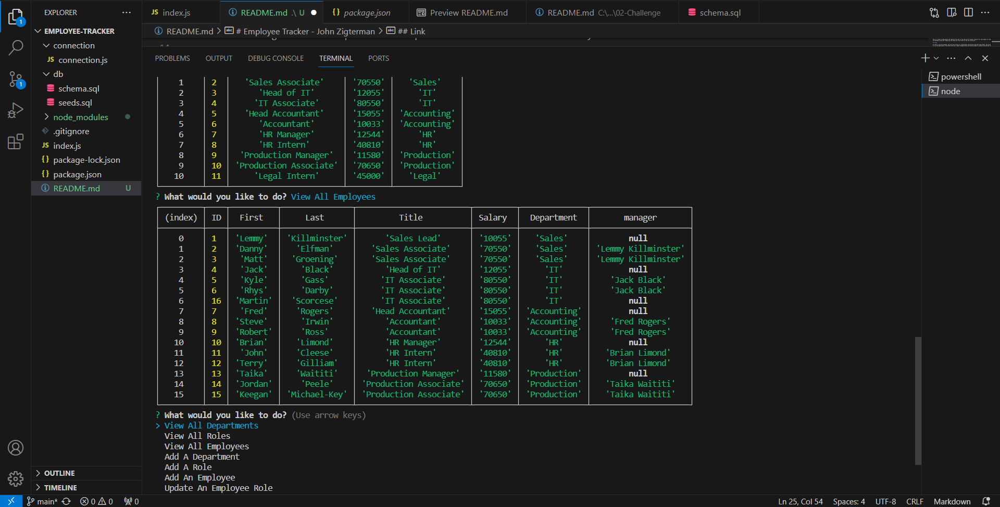

# Employee Tracker - John Zigterman

## Description

- The goal was to create an intuitive and easy to use employee tracker with node.js and inquirer.
- This application allows the user to view and add departments, roles, and employees. It also allows for role reassignment.
- The user is given a basic menu system that is simple to navigate and clearly outlines the functionality of the app.
- The database is directly queried using mysql queries implemented directly in index.js.
- This app would be very easy to expand in the future for other applications or to implement more specific features.

## Installation

This is a node.js application and requires the user to use node and to install inquirer for the prompts to function. The user must also initialize the database using the schema.sql and seeds.sql files found in the 'db' directory.

## Usage

In order to use the program, the user must follow all installation instructions and then type either 'npm start' or 'node index.js' in the console to run the application. From there they must simply navigate menus and follow prompts to achieve the desired results.

## Credits

I, John Paul Zigterman, completed this project by myself with the aid of the resources provided to me by the MSU coding bootcamp.

## Link

https://github.com/JohnPaulZigterman/employee-tracker

## Screenshot

## Demonstration Video

[Demonstration Video Link](https://drive.google.com/file/d/1lJ6Ko6I2y_paVreg7RHDO0h75LDlSvxE/view?usp=sharing)

## License

MIT License

Copyright (c) 2023 John Paul Zigterman

Permission is hereby granted, free of charge, to any person obtaining a copy
of this software and associated documentation files (the "Software"), to deal
in the Software without restriction, including without limitation the rights
to use, copy, modify, merge, publish, distribute, sublicense, and/or sell
copies of the Software, and to permit persons to whom the Software is
furnished to do so, subject to the following conditions:

The above copyright notice and this permission notice shall be included in all
copies or substantial portions of the Software.

THE SOFTWARE IS PROVIDED "AS IS", WITHOUT WARRANTY OF ANY KIND, EXPRESS OR
IMPLIED, INCLUDING BUT NOT LIMITED TO THE WARRANTIES OF MERCHANTABILITY,
FITNESS FOR A PARTICULAR PURPOSE AND NONINFRINGEMENT. IN NO EVENT SHALL THE
AUTHORS OR COPYRIGHT HOLDERS BE LIABLE FOR ANY CLAIM, DAMAGES OR OTHER
LIABILITY, WHETHER IN AN ACTION OF CONTRACT, TORT OR OTHERWISE, ARISING FROM,
OUT OF OR IN CONNECTION WITH THE SOFTWARE OR THE USE OR OTHER DEALINGS IN THE
SOFTWARE.